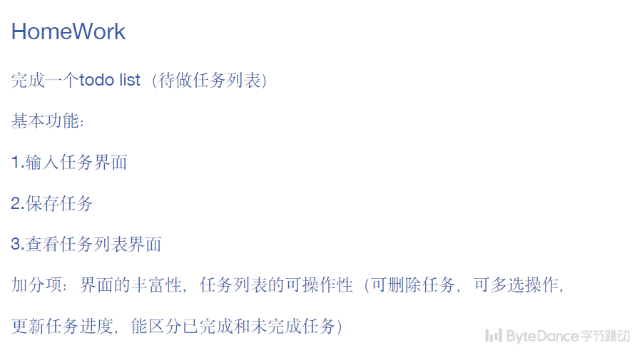

# Homework 6
## 题目要求

## 目录内容
- `app/src/main/java/com/crepuscule/jstu/homework6/`

  `DBHelper`
  `LinearLayouyManagerWithMaxItem`
  `MainActivity`
  `TaskPageEditActivity`
  `TaskPageShowActivity`
  `TodoElement`
  `TodoListAdapter`

- `app/src/main/java/com/crepuscule/jstu/homework6/layouy`

  `activity_task_edit_page.xml`
  `activity_task_show_page.xml`
  `activity_task_toollist.xml`
  `activity_task_todolist_element.xml`

## 实现效果
- 功能

  - 可添加待办事项

  - 悬浮按钮
  - 通过 CheckBox 勾选功能自动区分 `未完成 | 已完成` 事项
  - 未完成事项长按可编辑修改
  - 根据事项多少自动调整布局

- 演示
  